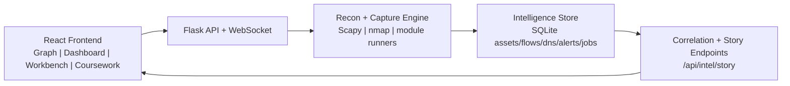

# NetVis

## The Network Brain for Recon and Visibility

NetVis is built to feel less like a scanner and more like an intelligence brain for your network.
It combines active recon, passive telemetry, and correlation logic to decide what to inspect next, then turns results into a story you can act on.

## Why It Is Different

- Adaptive scan flow: profile-aware jobs (`quick`, `standard`, `deep`) that pivot from discovery to deeper techniques.
- Multi-source intelligence: ARP, TCP/UDP probing, banners, DNS, capture flows, and detection signals in one view.
- Story-first output: a correlated intel timeline and narrative (`/api/intel/story`) instead of raw scan spam.
- Built for operators: graph, dashboard, workbench, and coursework runner from one UI.

## How the "Brain" Works Today

1. Discover assets and topology.
2. Rank hosts by exposure and signal quality.
3. Expand probing automatically using the selected profile.
4. Persist evidence in SQLite (`data/netvis.db`) and publish a correlated story.

This gives you guided autonomous behavior today, with operator control and guardrails.

## Agentic AI Framework (Coming Soon)

NetVis is evolving toward a full agentic workflow for network intelligence.

Planned direction:
- Goal-driven planner that picks techniques based on confidence and risk.
- Tool-using agents for discovery, fingerprinting, detection, and triage.
- Memory-aware reasoning over prior observations, not single-run snapshots.
- Human approval gates for sensitive actions.

If you want early collaboration on this roadmap, open an issue and describe your use case.

## Architecture



## Quick Start

### Requirements

- Python 3.9+
- Node.js 18+
- Optional: `nmap`
- Optional: root/sudo for packet capture and low-level scans

### Backend

```bash
python -m venv venv
source venv/bin/activate  # Linux/macOS
# venv\Scripts\activate    # Windows

pip install -r requirements.txt
cp .env.example .env
```

### Frontend

```bash
npm install
npm run dev
```

### Run NetVis

```bash
# Backend demo mode (no root required)
venv/bin/python server.py --demo

# Backend full mode
sudo venv/bin/python server.py
```

- Frontend: `http://localhost:3000`
- Backend: `http://localhost:5001`

## API Highlights

| Endpoint | Method | Purpose |
| --- | --- | --- |
| `/api/status` | GET | Runtime capabilities and network context |
| `/api/scan/smart` | POST | Adaptive profile-aware scan |
| `/api/scan/jobs` | POST/GET | Async scan orchestration |
| `/api/devices` | GET | Discovered asset inventory |
| `/api/connections` | GET | Observed traffic relationships |
| `/api/intel/story` | GET | Correlated narrative intelligence |
| `/api/intel/timeline` | GET | Chronological evidence feed |
| `/api/capture/start` | POST | Start passive capture |

## Safety and Scope

- Run only on networks you own or are authorized to test.
- Some techniques require elevated privileges.
- Optional API hardening: set `NETVIS_API_KEY` and use `X-API-Key` in requests.
- Toolkit endpoints are local-only by default unless API key policy allows otherwise.

## Deep Docs

- Runbook: `docs/RUNBOOK.md`
- NIP roadmap status: `docs/NIP_ROADMAP_STATUS.md`
- Rubric map: `RECON_RUBRIC_MAP.md`

## Contributing

PRs are welcome. Good contribution areas:
- Better autonomous decision logic in scan strategy
- Improved confidence scoring and risk ranking
- New protocol analyzers and technique adapters
- Exporters for SIEM/SOAR pipelines

## License

MIT. See `LICENSE`.
