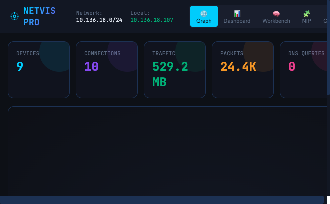
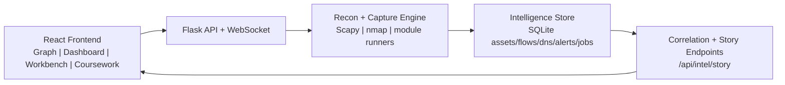

# NetVis

## The Network Brain for Recon and Visibility

NetVis is an end-to-end security engineering platform that combines active recon, passive telemetry, and correlation logic to decide what to inspect next, then turns raw signals into an analyst-ready story.



## Why It Is Different

- Adaptive scan flow: profile-aware jobs (`quick`, `standard`, `deep`) that pivot from discovery to deeper techniques.
- Multi-source intelligence: ARP, TCP/UDP probing, banners, DNS, capture flows, and detection signals in one view.
- Story-first output: correlated narrative and timeline (`/api/intel/story`, `/api/intel/timeline`) instead of raw scan noise.
- Built for operators: interactive graph + investigative panels + reproducible module tooling.

## Showcase Outcomes

- Multi-chain pipeline generates fused artifacts: `report/multichain_story.md` and `report/multichain_casefile.json`.
- Detection-side workflow produces matrix artifacts via Module 7 helpers.
- Background jobs provide progress tracking, status, and result retention through API.
- NIP substrate supports technique registry, event bus, baselines, and quality scoring.

## Agentic AI Framework (Coming Soon)

NetVis is evolving toward a full agentic workflow for network intelligence.

Planned direction:
- Goal-driven planner that selects techniques by confidence, cost, and risk.
- Tool-using agents for discovery, fingerprinting, detection, and triage.
- Memory-aware reasoning over prior observations, not single-run snapshots.
- Human-approval gates for sensitive actions.

## Architecture



## Project Layout

```text
app.py                  # Canonical backend entrypoint (wires refactored modules)
server.py               # API surface and core orchestration logic
store.py                # SQLite persistence layer
services/               # Job managers, scan service, metrics daemon
src/                    # React frontend (components, panels, views)
mod1..mod7/             # Rubric-aligned reconnaissance modules
nip/                    # Registry, event bus, schema, brain/quality helpers
docs/                   # Runbook and roadmap status docs
```

## Quick Start

### Requirements

- Python 3.9+
- Node.js 18+
- Optional: `nmap`
- Optional: root/sudo for packet capture and low-level scans

### Backend Setup

```bash
python -m venv venv
source venv/bin/activate  # Linux/macOS
# venv\Scripts\activate    # Windows

pip install -r requirements.txt
cp .env.example .env
```

### Frontend Setup

```bash
npm install
npm run dev
```

### Run NetVis

```bash
# Backend demo mode (no root required)
venv/bin/python app.py --demo

# Backend full mode
sudo venv/bin/python app.py
```

- Frontend: `http://localhost:3000`
- Backend: `http://localhost:5001`

## Quality Checks

```bash
# Backend tests
venv/bin/pip install -r requirements-dev.txt
venv/bin/pytest -q

# Frontend tests + production build
npm ci
npm test
npm run build
```

GitHub Actions CI runs these checks on push and pull request via `.github/workflows/ci.yml`.

## 5-Minute Demo Flow

1. Start backend in demo mode: `venv/bin/python app.py --demo`
2. Start frontend: `npm run dev`
3. Open `http://localhost:3000`
4. Show Graph + Dashboard + Workbench views
5. Run a scan job and open the generated intel story/timeline

## API Highlights

| Endpoint | Method | Purpose |
| --- | --- | --- |
| `/api/status` | GET | Runtime capabilities and network context |
| `/api/scan/smart` | POST | Adaptive profile-aware scan |
| `/api/scan/jobs` | POST/GET | Async scan orchestration |
| `/api/devices` | GET | Discovered asset inventory |
| `/api/connections` | GET | Observed traffic relationships |
| `/api/intel/story` | GET | Correlated narrative intelligence |
| `/api/intel/timeline` | GET | Chronological evidence feed |
| `/api/capture/start` | POST | Start passive capture |

## Safety and Scope

- Run only on networks you own or are authorized to test.
- Some techniques require elevated privileges.
- Optional API hardening: set `NETVIS_API_KEY` and use `X-API-Key` in requests.
- Toolkit endpoints are local-only by default unless API key policy allows otherwise.

## Deep Docs

- Runbook: `docs/RUNBOOK.md`
- NIP roadmap status: `docs/NIP_ROADMAP_STATUS.md`
- Rubric map: `RECON_RUBRIC_MAP.md`

## Contributing

PRs are welcome. High-impact contribution areas:
- Improved autonomous scan strategy and confidence scoring
- Additional protocol analyzers and technique adapters
- Better attack-path correlation and report generation
- SIEM/SOAR export integrations

## License

MIT. See `LICENSE`.
